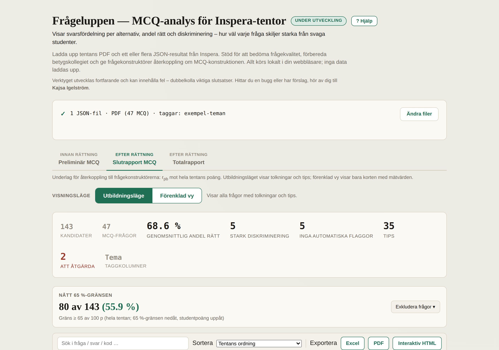
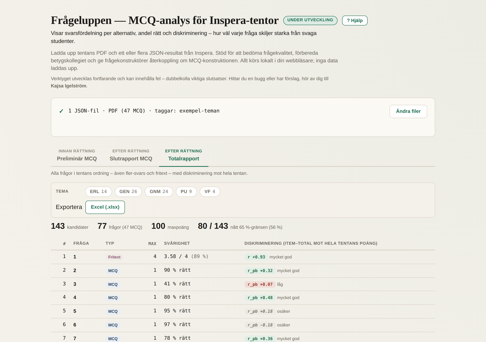

# Frågeluppen

**Ett webbverktyg för att analysera flervalstentor (MCQ) från Inspera – och för att bedöma och förbättra frågornas kvalitet.**

Frågeluppen visar, för varje fråga på en tenta, hur svaren fördelade sig, hur många som svarade rätt, och hur väl frågan *skiljer starka från svaga studenter* (diskriminering). Det används för att hitta frågor som behöver rättas om eller exkluderas, för att förbereda betygskollegiet, och för att ge frågekonstruktörer återkoppling.

---

## ▶ Så här kör du verktyget

Hela verktyget är **en enda fil**, `index.html`. Du behöver inte installera något eller titta på någon annan fil.

1. Klicka på **[`index.html`](index.html)** här ovanför i fillistan.
2. Klicka på **nedladdningsknappen** (ikonen med en pil, "Download raw file", uppe till höger i filvyn).
3. **Öppna den nedladdade filen** i en webbläsare (dubbelklicka på den, eller dra den till ett webbläsarfönster).
4. Väl inne: klicka på **"Visa exempel"** för att se en färdig analys på en avidentifierad exempeltenta – ingen egen data behövs.

> Vill du hellre ha allt på en gång: klicka på den gröna **Code**-knappen högst upp på repot → **Download ZIP**, packa upp, och öppna `index.html`.
>
> Verktyget behöver internetuppkoppling för att kunna läsa PDF- och Excel-filer (biblioteken hämtas från nätet). "Visa exempel" fungerar även utan.

---

## Så här ser det ut

Tre rapportvyer överst följer rättningsflödet; sammanfattningen visar hur många frågor som behöver åtgärdas:

Totalrapporten ger en översikt över hela tentan – varje frågas svårighet och diskriminering, filtrerbar på tema, med export till Excel:

*(Skärmbilderna är tagna med den inbyggda exempeltentan – syntetiska, avidentifierade data.)*

---

## Vad verktyget gör

- Läser tentans **PDF** och ett eller flera **JSON-resultat** från Inspera, samt en valfri **Excel** med teman per fråga.
- Visar per fråga: **svarsfördelning** per alternativ, **andel rätt** (svårighet) och **diskriminering** (punkt-biseriell item–total-korrelation), med färgkodad distraktoranalys.
- Tre rapportvyer: **Preliminär MCQ** (före rättning), **Slutrapport MCQ** (efter rättning) och **Totalrapport** (hela tentan, inför betygskollegiet).
- Filtrering på tema, exkludering av trasiga frågor, och export till **Excel, CSV, PDF** samt en fristående **interaktiv HTML** att dela.
- En inbyggd **"? Hjälp"** förklarar hur måtten tolkas.

Allt körs lokalt i webbläsaren – **inga data laddas upp någonstans**.

---

## Vad jag har gjort

Frågeluppen är utvecklad av mig, **Kajsa Igelström**, för analys av läkarprogrammets MCQ-tentor. Mitt bidrag är den pedagogiska och psykometriska utformningen:

- **Vilka mått som är relevanta och hur de ska tolkas** – svårighet, item–total-diskriminering och distraktoreffektivitet – och hur de presenteras så att en examinator kan agera på dem.
- **Arbetsflödet** kring preliminär rapport, slutrapport och totalrapport, kopplat till rättning och betygskollegium, och återkopplingen till frågekonstruktörer.
- **Kraven, besluten och granskningen** av vad som är korrekt (t.ex. hur diskriminering beräknas mot rätt kriterium, hur teman kopplas till frågor, vad som får delas vidare).

Kodimplementeringen är framtagen med AI-assisterad utveckling (Claude), utifrån min specifikation och löpande granskning. Utvecklingen har skett iterativt – se [`CHANGELOG.md`](CHANGELOG.md).

---

## Integritet

Verktyget bearbetar riktiga studentresultat lokalt i webbläsaren; ingenting laddas upp. Exporten och exempeldatan innehåller **endast aggregat** (antal per alternativ, n, diskriminering, teman) – aldrig enskilda kandidatsvar, identifierare eller rådata. Exempeltentan är en simulerad kohort som återger en riktig tentas statistik utan några riktiga svar eller frågetexter.

---

## Övriga filer (behövs inte för att köra verktyget)

| Fil | Vad det är |
|-----|-----------|
| [`index.html`](index.html) | **Hela verktyget.** Det enda du behöver för att köra det. |
| [`CHANGELOG.md`](CHANGELOG.md) | Utvecklingshistorik version för version. |
| [`docs/`](docs) | Skärmbilder till denna README. |
| [`CLAUDE.md`](CLAUDE.md) | Arbetsinstruktioner för vidareutveckling (AI-assisterad). |
| [`LICENSE`](LICENSE) | MIT-licens. |

## Licens

MIT – se [LICENSE](LICENSE). Fri att använda, ändra och dela, så länge upphovsrättsnotisen följer med.

## Kontakt

Kajsa Igelström – för frågor, buggar och förslag.
